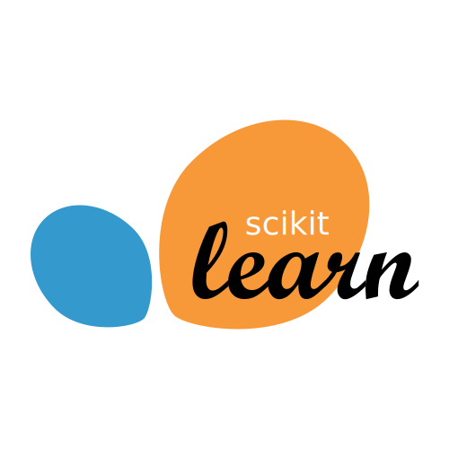

# Profile

Hi there, my name is Leslie.
I'm a Machine Learning and Software Engineer based in London.

## About me

- 💼 Machine Learning Engineer at [EQL](https://www.eql.ai/)

- <code title="King's College London"></code> Healthcare Technologies (AI Pathway) MSc | Physics with Medical Applications BSc Hons 

- 🗣️ Languages: English, Cantonese

| |  |
| ------------- | ------------- |

 

## My Skill Set  
<table>
  <tr>
    <td valign="top" width="25%">
      <h2><strong>Frontend</strong></h2>  
      
  
          
         
         
          
           
           
      

    </td>
    <td valign="top" width="25%">
      <h2><strong>Backend</strong></h2> 
      
  
          
          
          
          
          
          
      

    </td>
    <td valign="top" width="25%">
      <h2><strong>Packages</strong></h2> 
      
  
          
          
          
          
          
          
          
          
      

    </td>
    <td valign="top" width="25%">
      <h2><strong>DevOps</strong></h2> 
      
  
          
          
          
          
          
          
          
      

    </td>
  </tr>
</table>  

   

<!--
**leslie-zi-pan/leslie-zi-pan** is a ✨ _special_ ✨ repository because its `README.md` (this file) appears on your GitHub profile.
-->
