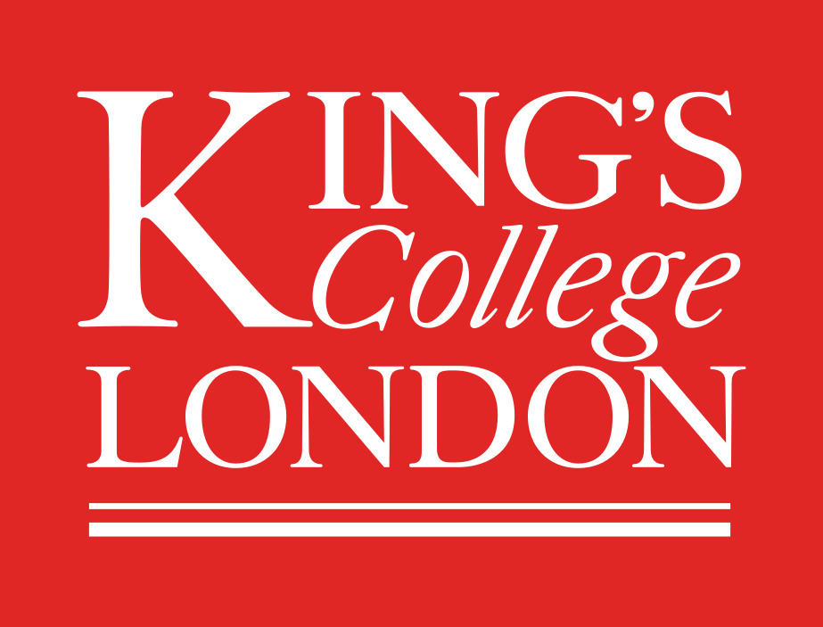

# Profile

Hi there, my name is Leslie.

I am an AI Engineer and Platform Engineer, building production
agentic AI systems. My work spans two halves: the AI
layer — multi-agent orchestration with LangGraph, structured outputs, evals and tracing — and the
platform beneath it, where I own the GCP data architecture, infrastructure-as-code, and cost.

The through-line is a single architectural view: generative AI works best as an *interface* to
mathematically grounded, deterministic-probabilistic backends. In a regulated domain a
system has to be calibrated, explainable and auditable, not merely fluent. Most of what I build
and study serves that goal.

## What I work on

- **Agentic systems in production** — LangGraph multi-agent architectures, stateful session
  orchestration, structured outputs, evaluation harnesses, and LangSmith tracing for explainable
  execution paths in a regulated setting.
- **The data platform** — a BigQuery Medallion architecture (Bronze/Silver/Gold) with Dataform
  transformations, provisioned via Terraform, serving as the analytical cold layer for an MSK
  digital-twin framework.
- **Bayesian grounding** — probabilistic models and likelihood-ratio reasoning used to constrain
  generative output, so clinical recommendations rest on something defensible.

## Selected work

- **LangChain v1.0 production migration** — led the refactor of 40+ production notebooks to
  LangChain v1.0 and Python upgrades: native structured output, explicit legacy boundaries, and a move
  to explicit state passing.
- **Analytical cold layer** — built the BigQuery and Dataform platform with fine-grained dataset permissions and version-controlled
  transformations.
- **Infrastructure as code** — standardised Terraform across data environments for reproducible,
  auditable provisioning.
- **Cloud cost optimisation** — a GCP FinOps audit across BigQuery and Firestore, securing six
  figures in confirmed annual savings.

## Research interests

I am working through a long-form self-study programme at the convergence of three areas, aimed at
building an **Active Digital Twin**:

- **Bayesian methods** — graphical models, variational inference, filtering, and model comparison.
- **Active inference and the Free Energy Principle** — discrete and continuous formulations,
  predictive coding, and expected-free-energy-driven decision making.
- **Digital twins** — data assimilation, surrogate and physics-informed models, and the
  uncertainty and V&V layer (calibration, conformal prediction, SaMD credibility) that makes a
  clinical twin deployable rather than a demo.

## About me

- AI Engineer and Platform Lead Engineer
- <code title="King's College London"></code> Healthcare Technologies (AI Pathway) MSc | Physics with Medical Applications BSc Hons
- Google Cloud Professional Machine Learning Engineer
- Languages: English, Cantonese

## Stack

| Area | Tools |
| --- | --- |
| **AI orchestration** | LangGraph · LangChain · LangSmith · Vertex AI · evals & tracing |
| **Cloud & data** | GCP · BigQuery · Dataform · Terraform · Pub/Sub · Cloud Run · Cloud Functions · Firestore |
| **Scientific Python** | NumPy · SciPy · pandas · scikit-learn · PyTorch · matplotlib |
| **Languages** | Python · TypeScript · Node.js · SQL · C# |
| **Front end** | React · Tailwind CSS |
| **Practices** | Medallion architecture · Infrastructure as Code · FinOps · TDD |

 

 
<!--
**leslie-zi-pan/leslie-zi-pan** is a special repository because its `README.md` (this file)
appears on your GitHub profile.
-->
